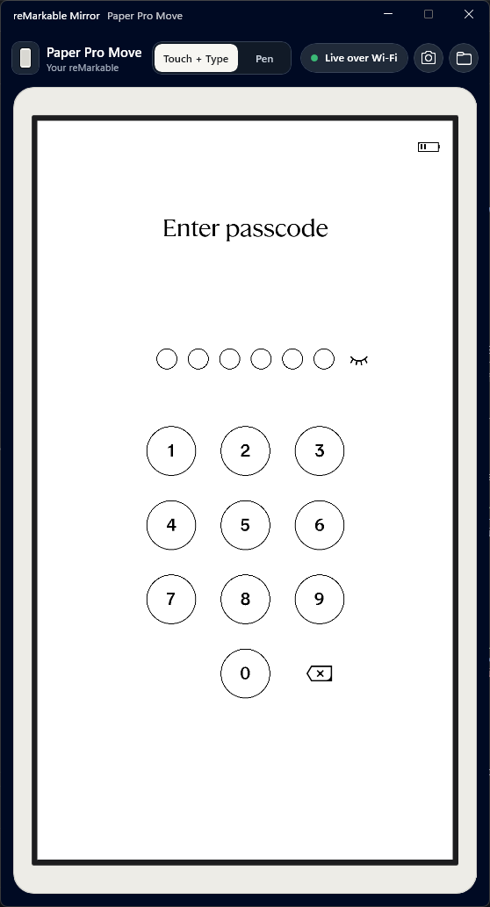
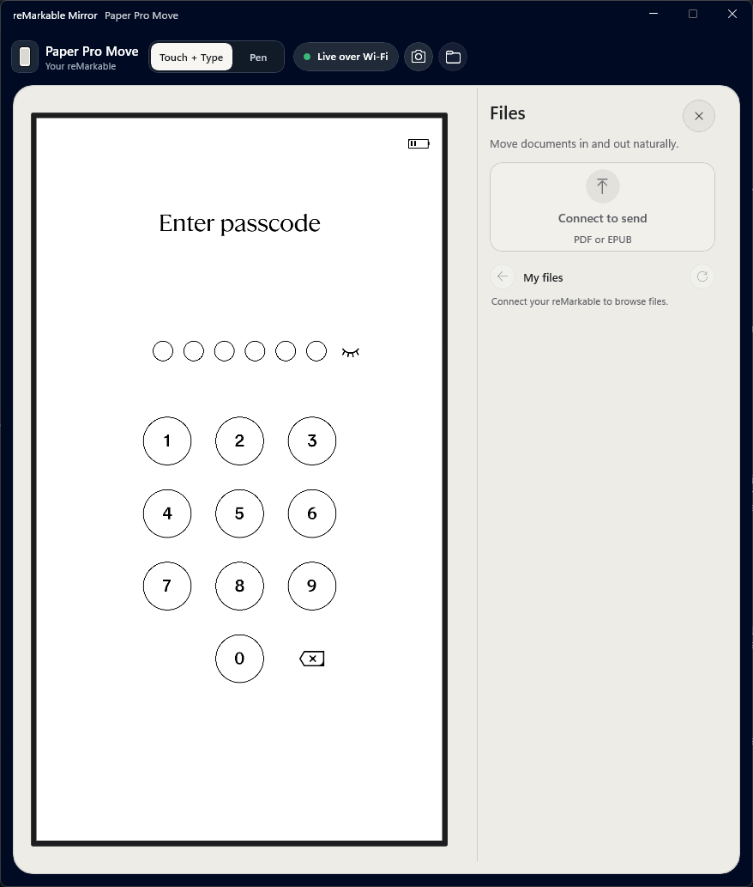

# reMarkable Mirror

**Your reMarkable, right on your Windows desktop.**

  

I built reMarkable Mirror because I wanted the tablet on my desk to feel like
part of my computer. I wanted to click it, type into it, use my mouse as a pen,
take a screenshot, and move a document without reaching for a second utility.

That is what this app does. It shows the tablet's real interface inside a compact
native Windows app and connects directly over USB-C or your local Wi-Fi. There is
no cloud relay and no iFixRobots account.

> [!IMPORTANT]
> This is independent community software. It is not affiliated with, endorsed
> by, or supported by reMarkable AS.

## Start here

The full setup is in [Getting started](docs/GETTING_STARTED.md). Read it once
from the top before enabling Developer Mode. It covers the reset, backup,
Windows prerequisites, SSH pairing, installation, first connection, and Wi-Fi
check in one path.

> [!WARNING]
> Enabling Developer Mode factory-resets the tablet. Back up first. The reset
> also forgets Wi-Fi, so you must reconnect it from the tablet afterward.

## What it does

- Mirrors the live `954x1696` Paper Pro Move display over USB or Wi-Fi
- Treats mouse clicks and keyboard input as one natural **Touch + Type** mode
- Provides a separate mouse-as-pen mode
- Copies screenshots to the clipboard or saves them as PNG files
- Sends PDFs with drag and drop; EPUB support is present but still needs a full
  device test
- Browses and exports documents through the tablet's stock Files service
- Recovers from ordinary lock and short-sleep states, and only shows **Live**
  when the display and controls are both ready
- Keeps the window shaped like the tablet, with a smooth reversible Files drawer

  

The screenshot above shows what happens while the tablet is locked: display and
input stay live, while Files waits for the passcode.

## Current compatibility

This is the setup I use and have tested:

| Part | Tested setup |
| --- | --- |
| Tablet | reMarkable Paper Pro Move, code name `chiappa` |
| Tablet software | Beta `3.28.0.164`, OS build `5.8.199` |
| Installed app | Windows 11 x64, minimum build `22621` |
| Current source build path | Windows 11 x64 `23H2` or newer |
| Connections | Direct USB-C and Wi-Fi on the same network as the PC |

I have not tested other reMarkable models or firmware versions yet. The installer
depends on Paper Pro Move input and system details. If your configuration differs,
stop before running tablet setup and open an issue with the exact model and
software version.

## Availability

Every push to `main` builds two Windows downloads in GitHub Actions:

- **remarkable-mirror-windows-installer** contains the complete installer,
  Windows package, tablet components, and setup guide. Use this for a new setup.
- **remarkable-mirror-portable-windows-x64** contains one
  `ReMarkableMirror.exe`. Use it only after the installer has already prepared
  the tablet and Windows account.

Open **Actions > Build Windows downloads**, choose a successful run, and find
both files under **Artifacts**. [Getting started](docs/GETTING_STARTED.md) walks
through the complete installer path.

The repository is intentionally private while I finish the owner review. The
downloads are therefore available only to signed-in GitHub collaborators. There
is no public GitHub Release yet.

## What is still open

- I still need to test EPUB import and every transfer format over Wi-Fi
- Native RMDOC export works; native RMDOC import is not in the UI yet
- The app can reconnect when the connection changes between USB and Wi-Fi, but I
  have not fully tested both directions while the app is open
- A fully suspended tablet turns off Wi-Fi, so a network packet cannot wake it
- A firmware A/B root-slot switch can require running a supported release's
  `Install.cmd` again
- The new Getting started guide still needs one complete run from a blank
  Windows setup and freshly reset tablet before the first public binary release

## Privacy and security

Mirror talks directly to your tablet. Documents, screenshots, credentials, and
usage data are not uploaded to an iFixRobots service. Device profiles and
credentials stay on the current Windows account.

Wireless control uses Developer Mode root SSH over WLAN with a dedicated local
key. Use it only on a private network you control, such as your home network.
Avoid public and guest Wi-Fi. The Files service is not published on Wi-Fi: the
app reaches tablet loopback through the SSH connection.

Developer Mode weakens the tablet's normal secure-boot protections. reMarkable
documents that tradeoff directly in its
[Developer Mode guide](https://developer.remarkable.com/documentation/developer-mode).
Read [Privacy](docs/PRIVACY.md) and the [Security policy](SECURITY.md) before
sharing logs or diagnostics.

## How it works

The Windows app keeps one active connection at a time and reconnects when USB or
Wi-Fi changes. It verifies the tablet's SSH identity, reads the display through
Xovi, and starts touch, pen, and keyboard input only while Mirror is connected.
Nothing is added to tablet startup for input.

Files stays separate. A packaged GPL-3.0-only loopback extension makes
Xochitl's stock Files service available on tablet loopback, and Windows reaches
it only through SSH forwarding. The transport wake endpoint also stays on
tablet loopback and the direct USB interface. It does not listen on the tablet's
Wi-Fi address.

Read [Architecture](docs/ARCHITECTURE.md) for the component and lifecycle map.

## Build and contribute

Start with [Development](docs/DEVELOPMENT.md) and
[Contributing](CONTRIBUTING.md). The repository includes the WinUI host, ARM64
Go companions, the Xovi Files extension source, packaging and install scripts,
and focused policy checks.

## Documentation

- [Getting started](docs/GETTING_STARTED.md)
- [Device setup reference](docs/DEVICE_SETUP.md)
- [Troubleshooting](docs/TROUBLESHOOTING.md)
- [Architecture](docs/ARCHITECTURE.md)
- [Development](docs/DEVELOPMENT.md)
- [Privacy](docs/PRIVACY.md)
- [Release process](docs/RELEASING.md)
- [Support](SUPPORT.md)
- [Third-party notices](THIRD_PARTY_NOTICES.md)

## License

reMarkable Mirror is licensed under `GPL-3.0-only`. See [LICENSE](LICENSE).

`reMarkable` is a trademark of reMarkable AS. The name is used only to describe
device compatibility.
