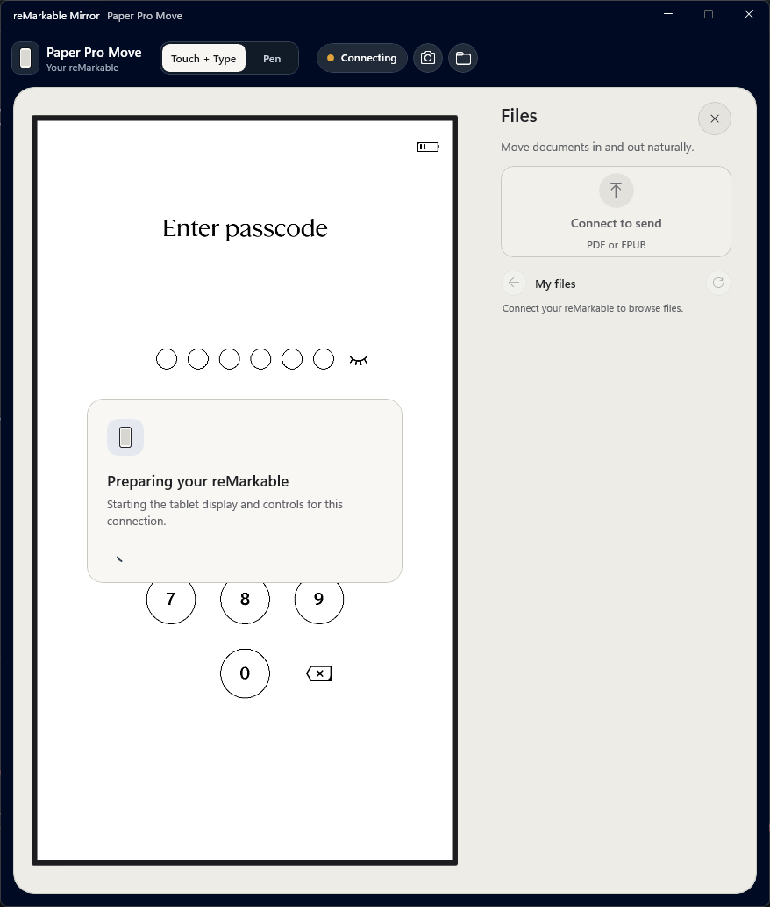

# Start here

You already have a reMarkable Mirror release package. This guide takes you from
that folder to a working USB and Wi-Fi connection. Keep the whole extracted
folder together while you install it.

> [!IMPORTANT]
> This package targets the reMarkable Paper Pro Move, code name `chiappa`. The
> exercised tablet software is beta `3.28.0.164`, OS build `5.8.199`. Do not run
> tablet setup on another model or software version unless the release notes
> explicitly include it.

The installed app needs Windows 11 x64 build `22621` or newer.

> [!NOTE]
> I have exercised these pieces on my own tablet, but this exact packaged path
> still needs one complete run on a freshly reset tablet and a clean Windows
> account. Stop at the first mismatch instead of improvising past it.


## Before Developer Mode

> [!WARNING]
> Enabling Developer Mode factory-resets the tablet and removes saved Wi-Fi.

Let reMarkable cloud sync finish, then confirm your current notebooks, documents,
and folders are visible in the official
[reMarkable desktop app](https://support.remarkable.com/articles/Knowledge/Desktop-app)
or mobile app. If they are not visible somewhere other than the tablet, stop
here.

Follow reMarkable's official
[Developer Mode guide](https://developer.remarkable.com/documentation/developer-mode).
On the tablet, the current path is:

**Settings > General > Paper Tablet > Software > Advanced > Developer Mode**

After the reset:

1. Finish first-run setup.
2. Sign into the same reMarkable account used for the backup.
3. Reconnect the tablet to Wi-Fi from its own screen.
4. Wait until the tablet's network screen explicitly says **Connected**.
5. Wait for cloud sync and confirm the expected notebooks, documents, and
   folders return.
6. Complete the first passcode unlock after boot.
7. Find the Developer Mode root password under **Settings > General > Help >
   About > Copyrights and Licenses**.
8. Enable **Settings > General > Storage > USB web interface**.

Mirror never needs the Wi-Fi password. Enter it only on the tablet.
The reset does not restore that password, Developer Mode credentials, locally
installed software, or every device preference.

> [!NOTE]
> The PC and tablet must be able to reach each other directly on Wi-Fi. Guest
> networks and access points with client isolation usually block this.

## Prepare Windows

You need Windows 11 x64 build `22621` or newer, PowerShell 7.5 or newer, Windows
OpenSSH Client, and a USB-C data cable. The signed-in Windows account must itself
be an administrator. Entering a different administrator's credentials is not a
tested install path because setup stores the app and SSH profile for the signed-in
account.

Install PowerShell 7 if needed. Microsoft's
[PowerShell installation guide](https://learn.microsoft.com/powershell/scripting/install/install-powershell-on-windows)
lists WinGet and installer options. With WinGet:

```powershell
winget install --id Microsoft.PowerShell --source winget
```

In an elevated **Windows PowerShell** window, check OpenSSH:

```powershell
Get-WindowsCapability -Online -Name OpenSSH.Client~~~~0.0.1.0
```

If the state is `NotPresent`, install it:

```powershell
Add-WindowsCapability -Online -Name OpenSSH.Client~~~~0.0.1.0
```

Open PowerShell 7 and confirm:

```powershell
pwsh --version
Get-Command ssh.exe, scp.exe, ssh-keygen.exe, ssh-keyscan.exe
```

## Pair the tablet over USB

Connect the tablet directly with the USB-C data cable. Wake it and complete the
first passcode unlock after boot. The direct Developer Mode address is
`10.11.99.1`. Check the same direct USB route that the installer requires:

```powershell
$usbAddresses = @(
    Get-NetIPAddress `
        -IPAddress 10.11.99.11 `
        -AddressFamily IPv4 `
        -ErrorAction SilentlyContinue
)
if ($usbAddresses.Count -ne 1) {
    throw 'Windows does not have exactly one reMarkable USB address.'
}
$usbAddress = $usbAddresses[0]

$usbAdapters = @(
    Get-NetAdapter `
        -InterfaceIndex $usbAddress.InterfaceIndex `
        -ErrorAction SilentlyContinue
)
$usbRoutes = @(
    Get-NetRoute `
        -InterfaceIndex $usbAddress.InterfaceIndex `
        -DestinationPrefix '10.11.99.0/27' `
        -ErrorAction SilentlyContinue
)

if ($usbAddress.PrefixLength -ne 27 -or
    $usbAddress.AddressState -ne 'Preferred' -or
    $usbAddress.SkipAsSource -or
    $usbAdapters.Count -ne 1 -or
    $usbAdapters[0].Status -ne 'Up' -or
    -not $usbAdapters[0].HardwareInterface -or
    $usbAdapters[0].Virtual -or
    $usbAdapters[0].PnPDeviceID -notmatch '^USB\\' -or
    $usbRoutes.Count -ne 1 -or
    $usbRoutes[0].NextHop -ne '0.0.0.0' -or
    $usbRoutes[0].State -ne 'Alive') {
    throw 'The reMarkable direct USB address, adapter, or route is not ready.'
}

[pscustomobject]@{
    Address = "$($usbAddress.IPAddress)/$($usbAddress.PrefixLength)"
    Adapter = $usbAdapters[0].InterfaceAlias
    Route = $usbRoutes[0].DestinationPrefix
    State = $usbRoutes[0].State
}
```

The output should show `10.11.99.11/27`, a physical USB adapter,
`10.11.99.0/27`, and `Alive`. If the block throws, open the bundled
[Troubleshooting guide](TROUBLESHOOTING.md#usb-does-not-create-the-direct-tablet-network).

Create a dedicated key and save the USB host key:

```powershell
$key = Join-Path $env:USERPROFILE '.ssh\remarkable_chiappa_ed25519'
$knownHosts = Join-Path $env:USERPROFILE '.ssh\remarkable_known_hosts'

New-Item -ItemType Directory -Path (Split-Path $key) -Force | Out-Null

if (-not (Test-Path -LiteralPath $key)) {
    ssh-keygen.exe -t ed25519 -f $key -C 'remarkable-mirror' -N ''
}

$derivedPublicKey = @(& ssh-keygen.exe -y -f $key 2>$null)
$derivedPublicKeyFields = if ($derivedPublicKey.Count -eq 1) {
    @($derivedPublicKey[0] -split '\s+')
} else {
    @()
}
if ($LASTEXITCODE -ne 0 -or
    $derivedPublicKeyFields.Count -lt 2 -or
    $derivedPublicKeyFields[0] -ne 'ssh-ed25519' -or
    [string]::IsNullOrWhiteSpace($derivedPublicKeyFields[1])) {
    throw 'The Mirror private key could not produce one Ed25519 public key.'
}
"$($derivedPublicKeyFields[0]) $($derivedPublicKeyFields[1]) remarkable-mirror" |
    Set-Content -LiteralPath "$key.pub" -Encoding ascii
```

An existing private key is reused. Its public half is rebuilt from that private
key, so a stale or missing `.pub` file cannot pair the wrong identity. The next
step re-pairs the same dedicated key after a factory reset without replacing it.

Scan one Ed25519 host key, reject an empty or malformed result, then show the
fingerprint you are about to trust:

```powershell
$scannedHostKey = @(
    & ssh-keyscan.exe -T 5 -t ed25519 10.11.99.1 2>$null
)
if ($LASTEXITCODE -ne 0 -or
    $scannedHostKey.Count -ne 1 -or
    $scannedHostKey[0] -notmatch '^10\.11\.99\.1\s+ssh-ed25519\s+\S+$') {
    throw 'The tablet did not return one valid Ed25519 SSH host key.'
}
$scannedHostKey |
    Set-Content -LiteralPath $knownHosts -Encoding ascii

$fingerprint = (& ssh-keygen.exe -lf $knownHosts 2>&1) -join "`n"
if ($LASTEXITCODE -ne 0 -or [string]::IsNullOrWhiteSpace($fingerprint)) {
    throw 'The saved tablet host key could not be fingerprinted.'
}
$fingerprint
```

This is trust on first use across the physical USB cable. If the scan fails,
wake and unlock the tablet, confirm the USB address and route, and run only this
scan block again.

Replace the private key's inherited Windows permissions with one rule for the
current account:

```powershell
$sid = [System.Security.Principal.WindowsIdentity]::GetCurrent().User
$acl = [System.Security.AccessControl.FileSecurity]::new()
$acl.SetOwner($sid)
$acl.SetAccessRuleProtection($true, $false)
$acl.AddAccessRule(
    [System.Security.AccessControl.FileSystemAccessRule]::new(
        $sid,
        [System.Security.AccessControl.FileSystemRights]::FullControl,
        [System.Security.AccessControl.AccessControlType]::Allow
    )
)
Set-Acl -LiteralPath $key -AclObject $acl

$keyAcl = Get-Acl -LiteralPath $key
$keyRules = @($keyAcl.GetAccessRules(
    $true,
    $false,
    [System.Security.Principal.SecurityIdentifier]
))
[pscustomobject]@{
    Owner = $keyAcl.GetOwner(
        [System.Security.Principal.SecurityIdentifier]).Value
    Protected = $keyAcl.AreAccessRulesProtected
    RuleCount = $keyRules.Count
    RuleSid = $keyRules[0].IdentityReference.Value
    Rights = $keyRules[0].FileSystemRights
}
```

The output must show `Protected` as `True`, `RuleCount` as `1`, the current SID
for both owner and rule, and `FullControl` rights.

Install the public key. Enter the generated tablet root password when prompted:

```powershell
Get-Content -LiteralPath "$key.pub" |
    ssh.exe -F NUL `
        -o "UserKnownHostsFile=$knownHosts" `
        -o StrictHostKeyChecking=yes `
        root@10.11.99.1 `
        'umask 077; mkdir -p /home/root/.ssh; cat >> /home/root/.ssh/authorized_keys'
```

Verify key-only access:

```powershell
ssh.exe -F NUL `
    -i $key `
    -o BatchMode=yes `
    -o IdentitiesOnly=yes `
    -o "UserKnownHostsFile=$knownHosts" `
    -o StrictHostKeyChecking=yes `
    root@10.11.99.1 true
```

Success returns to the prompt without output.

## Install

Return to this extracted release folder and double-click `Install.cmd`.

Keep the tablet connected and unlocked until setup finishes. Accept the one
Windows administrator prompt. The installer validates the package, installs the
Windows app, provisions matching tablet components, and enables the tablet's
official SSH-over-WLAN setting.

Before starting, confirm the tablet still explicitly says Wi-Fi is
**Connected**. If Wi-Fi is not ready, the installer can finish USB work but must
pause wireless pairing. Connect Wi-Fi on the tablet and run this same
`Install.cmd` again.

It does not enable Developer Mode, bypass a passcode, or ask for the Wi-Fi
password.

On success, the installer window closes and reMarkable Mirror opens
automatically. If the installer window stays open, setup failed and its last
lines contain the error. Read that error before closing the window.

## Prove USB first

Mirror should already be open after a successful install. If it was closed, open
it from Start. Wait for **Live over USB**.



- Use **Touch + Type** to click and type without switching modes.
- Use **Pen** to treat the mouse like a stylus.
- Left-click the camera button to copy a screenshot. Right-click it and choose
  **Save screenshot as...** to open **Save As**.
- Open **Files** while the tablet is unlocked.
- Drop a small disposable PDF into the tablet. EPUB import is not part of the
  completed proof yet.
- Click a document to open **Save As** for PDF. Right-click it to choose
  **Save as PDF...** or **Save native RMDOC...**. Explorer drag-out is not
  implemented yet.

If the Files drawer waits while the tablet is passcode-locked, that is normal.
Unlocking starts the stock Files listener again.


## Then prove Wi-Fi

Confirm the tablet says Wi-Fi is connected. Unplug USB-C, leave the tablet awake,
and wait for **Live over Wi-Fi**. Repeat touch, keyboard, and screenshot checks,
then confirm that the Files library loads. The broader Wi-Fi import and export
matrix is still being tested.

Full Linux suspend turns off Wi-Fi, so a network packet cannot wake a disconnected
radio. Press the power button or connect USB-C and Mirror will reconnect when the
tablet is reachable.

## If something fails

Do not rerun random setup commands. Match the visible app state to the bundled
[Troubleshooting guide](TROUBLESHOOTING.md).

After a firmware A/B root-slot switch, first confirm that this release explicitly
supports the tablet's new software version. If it does not, stop and report the
new version. If it does, reconnect and unlock over USB, then run that supported
release's `Install.cmd` again.
